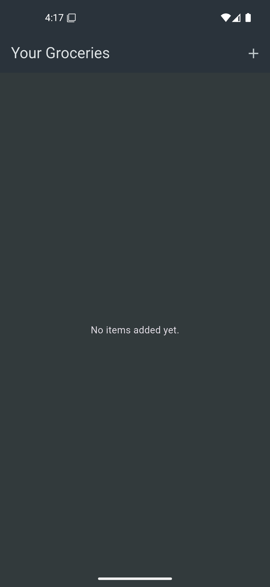
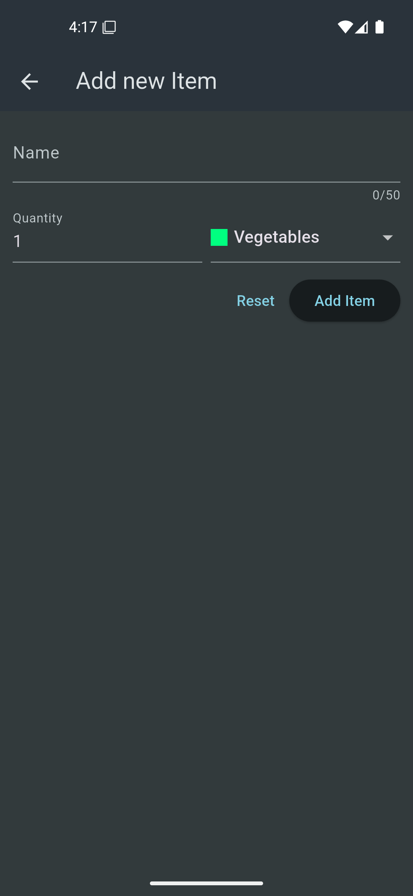
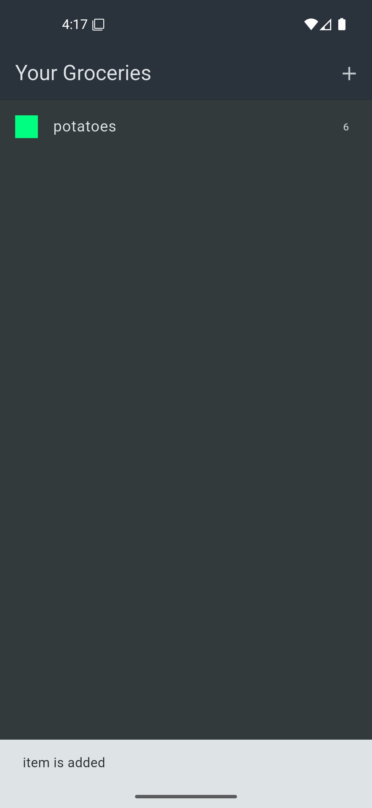
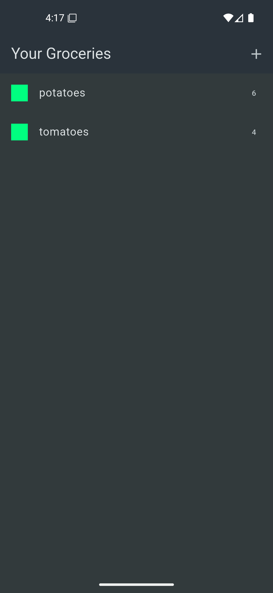
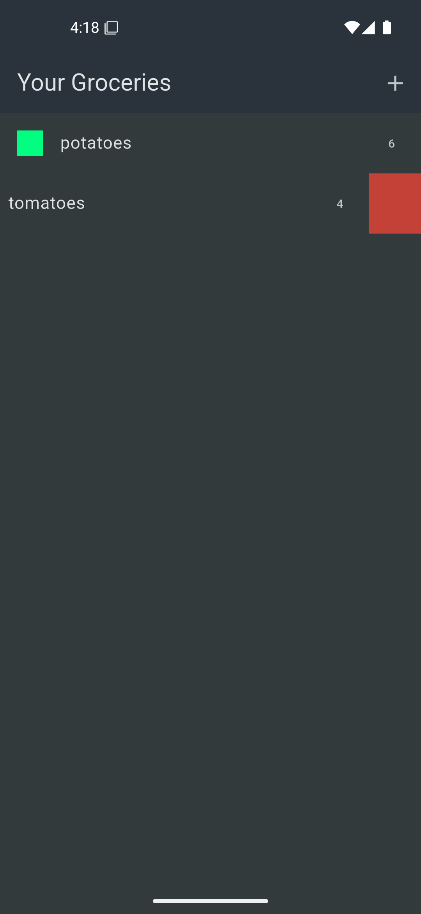
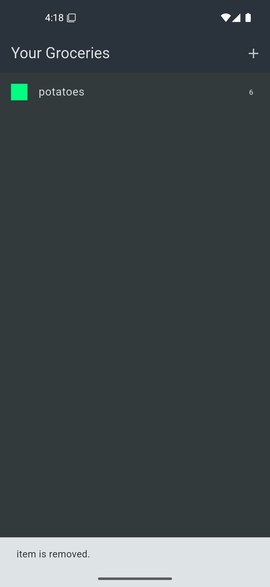

# 🛒 Shopping List App  

A simple **Shopping List App** using **Flutter** and **Firebase Realtime Database**. This app allows users to add, view, update, and delete grocery items with a clean and intuitive UI.


## ✨ Features  

- **Add Items** – Users can enter item name, quantity, and category to store in the database.  
- **View Items** – Displays a list of all saved grocery items.  
- **Update Items** – Modify existing grocery item details.  
- **Delete Items** – Remove grocery items from the list with a confirmation prompt.  
- **Firebase Integration** – Data is stored in **Firebase Realtime Database**.  
- **Error Handling** – Proper exception handling and UI feedback using SnackBars.  


## 📸 Screenshots  
<p align="center">
    
    
    
    
    
    
</p>


## 📦 Dependencies  

| Package               | Purpose                                         |  
|----------------------|-------------------------------------------------|  
| `firebase_core`      | Required to initialize Firebase in Flutter.    |  
| `firebase_database`  | Firebase Realtime Database integration.        |  
| `http`               | Handles HTTP requests for database operations. |  

### Install dependencies using:  
```sh
flutter pub get
```


## Installation
1. Clone the repository:
```bash
git clone https://github.com/your-username/shopping-list-app.git 
```
2. Navigate to the project directory:
```bash
cd shopping-list-app
```

3. Install dependencies:
```bash
flutter pub get
```

4. Run the app:
```bash
flutter run
```

## 💡 Usage Guide
- Add an Item → Enter a name, quantity, and select a category, then tap "Add Item".
- Update an Item → Tap the edit icon, modify details, and save.
- Delete an Item → Swipe left on an item to delete and confirm.
- View Stored Items → All grocery items are displayed on the home screen.